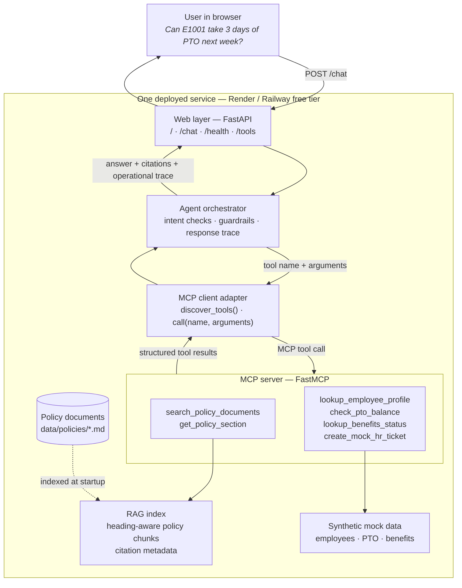
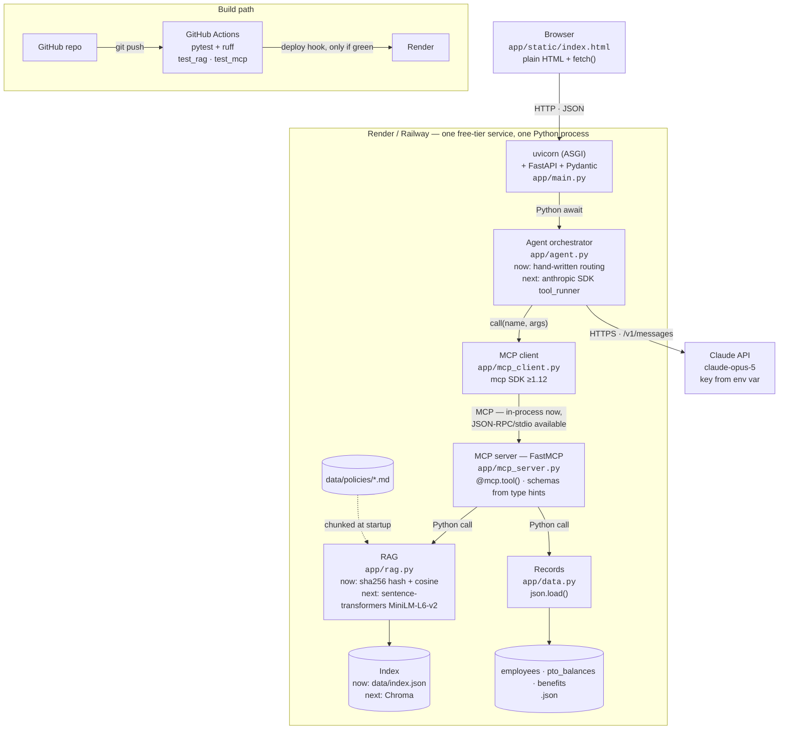

# Design and Evaluation

## Architecture



<details>
<summary>Text-only diagram</summary>

```text
USER (browser)
  │ POST /chat: message, optional employee ID, optional confirmation
  ▼
FASTAPI WEB APP — /, /chat, /health, /tools
  ▼
AGENT ORCHESTRATOR — intent checks, safety checks, trace assembly
  │ tool name + typed arguments
  ▼
MCP CLIENT ADAPTER — discovers and invokes registered MCP tools
  ▼
FASTMCP SERVER
  ├─ Policy tools ─────► RAG index ◄──── policy Markdown documents
  └─ Employee tools ───► synthetic JSON employee/PTO/benefits records
  │ structured results
  ▼
AGENT → final answer + citations + operational tool trace → USER
```
</details>

The deployed first draft runs as one free-tier-friendly FastAPI service. The MCP server definitions live in `app/mcp_server.py`; the agent discovers registered schemas and calls tool names with typed arguments through `app/mcp_client.py`. This keeps the tool boundary explicit while avoiding a paid service. The server can also run independently over stdio with `python -m app.mcp_server`.

In simple terms: the employee asks a question, the agent chooses the evidence or employee-data tools it needs, the MCP server retrieves that information, and the agent returns a cited answer. The response also exposes a concise record of the tools used, their arguments, and their results for the demo.

## Technology stack

The same system at the product level — which library or service implements each block, and what protocol runs between them. Dashed boxes are planned rather than present in the first draft.



<details>
<summary>Text-only diagram</summary>

```text
BROWSER — app/static/index.html, plain HTML + fetch()
  │ HTTP · JSON — POST /chat · GET /health · /tools
  ▼
RENDER / RAILWAY — one free-tier service, one Python process
  │
  ├─ uvicorn (ASGI) → FastAPI + Pydantic — app/main.py
  │     │ Python await
  │     ▼
  ├─ AGENT ORCHESTRATOR — app/agent.py
  │     now:  hand-written if/elif routing (no LLM)
  │     next: anthropic SDK tool_runner ──HTTPS──► Claude API
  │     │ call(name, args)
  │     ▼
  ├─ MCP CLIENT — app/mcp_client.py, mcp SDK >=1.12
  │     │
  │  ═══╪═══ MCP boundary — in-process now, JSON-RPC/stdio available
  │     ▼
  ├─ MCP SERVER — app/mcp_server.py, FastMCP
  │     search_policy_documents, get_policy_section  ──► RAG
  │     lookup_employee_profile, check_pto_balance,
  │     lookup_benefits_status, create_mock_hr_ticket ──► DATA
  │     │ Python call
  │     ▼
  ├─ RAG — app/rag.py
  │     now:  sha256 feature hash + cosine → data/index.json
  │     next: sentence-transformers MiniLM-L6-v2 → Chroma
  │     ◄── data/policies/*.md, chunked at startup
  │
  └─ DATA — app/data.py, json.load()
        employees.json · pto_balances.json · benefits.json

BUILD PATH
  GitHub repo ──git push──► GitHub Actions (pytest + ruff)
                               └── deploy hook, only if green ──► Render
```
</details>

### Interfaces

| From | To | Protocol | Carried by |
| --- | --- | --- | --- |
| Browser | FastAPI | HTTP / JSON | `fetch()` |
| uvicorn | FastAPI | ASGI | `uvicorn app.main:app` |
| FastAPI | Orchestrator | Python `await` | `agent.respond()` |
| Orchestrator | Claude API | HTTPS REST | `anthropic` SDK → `/v1/messages` |
| Orchestrator | MCP client | Python call | `mcp_client.call(name, args)` |
| MCP client | MCP server | **MCP** | `mcp` SDK — in-process now, JSON-RPC/stdio available |
| MCP tools | RAG / records | Python call | `rag.search()`, `data.employee()` |
| RAG | Index | File I/O | `data/index.json` today, Chroma next |
| GitHub | Actions | Webhook | `.github/workflows/ci.yml` |
| Actions | Render | Deploy hook | Fires only on green |

Two properties are worth stating explicitly because the diagram makes them visible:

- **The LLM attaches to the orchestrator, not to the MCP server.** The model decides *which* tool to call; MCP is *how* the call travels. The two concerns are orthogonal, so introducing an LLM planner changes nothing below the MCP boundary.
- **The MCP boundary is the only crossing that is not a plain Python call.** Everything above it is application code; everything below is reached through discovered tool schemas. That line is what distinguishes a real MCP integration from wrapped direct function calls.

### Options considered per block

| Block | Chosen | Alternatives considered |
| --- | --- | --- |
| Web framework | FastAPI | Flask (sync, weaker streaming); Streamlit (no clean `/chat` + `/health`) |
| Chat UI | Static HTML + `fetch` | HTMX + SSE for token streaming; React/Next.js (needs a second service) |
| LLM provider | Claude API, model via env var | Groq and OpenRouter free tiers; Ollama for local development only |
| Orchestration | Anthropic SDK tool runner or a manual tool-use loop | LangGraph / CrewAI — heavy, and they hide the orchestration this project must explain |
| MCP server | FastMCP, in-process | Same server over stdio (supported today); separate HTTP service (costs a second free-tier service) |
| Embeddings | Feature hash now, sentence-transformers MiniLM-L6-v2 next | fastembed (ONNX, lighter runtime); hosted free-tier embedding APIs |
| Vector store | JSON index now, Chroma next | FAISS; sqlite-vec; LanceDB; pgvector |
| Hosting | Render | Railway (better cold starts); Fly.io (scale-to-zero, needs a Dockerfile) |
| CI | GitHub Actions | Required by the project brief |
| Evaluation | pytest + a scoring script | RAGAS and DeepEval — richer metrics, but add an LLM judge and dependency weight |

Note that Anthropic exposes no embeddings endpoint, so the embedding block uses a different provider from the LLM block regardless of which model serves the agent.

## RAG design

Policy documents are Markdown files chunked at headings, then split to roughly 220 words with overlap. A stable 256-dimension feature-hash embedding and cosine similarity provide deterministic, local retrieval. Each result persists an ID, document, section, score, and source snippet. Top-k is four. The assistant cites returned chunks and declines unsupported policy questions rather than inventing answers.

## MCP tools and schemas

| Tool | Required arguments | Output |
| --- | --- | --- |
| `search_policy_documents` | `query`, optional `limit` | Citable policy chunks |
| `get_policy_section` | `document`, `section` | Matching policy sections |
| `lookup_employee_profile` | `employee_id` | Synthetic employee record |
| `check_pto_balance` | `employee_id` | Synthetic PTO record |
| `lookup_benefits_status` | `employee_id` | Synthetic benefits record |
| `create_mock_hr_ticket` | `employee_id`, `summary`, `category` | Confirmation-required mock ticket |

## Agent orchestration and guardrails

The deterministic first-draft planner classifies PTO, benefits, policy, and sensitive-workplace-conduct requests. It retrieves policy evidence for every supported response, then adds employee-specific data only through MCP. It returns an operational trace of tool names, arguments, summarized outputs, citations, and answer basis; it does not reveal hidden chain-of-thought. Missing IDs cause clarification. Sensitive reports escalate to HR. Ticket creation is a mock draft and only runs with `confirm_mock_action=true`.

## Deployment and CI/CD

The repository contains both `render.yaml` and `railway.toml`, so either host can run one Python web service with the same tested build command and the platform-provided `PORT`. Both configurations probe `/health`, and the build runs the full test suite before the service starts. The GitHub Actions workflow independently runs the same test suite on pushes and pull requests. Python is pinned with `.python-version` to avoid a host-default version changing underneath the application.

## Evaluation

The starter evaluation set is in `evaluation/evaluation_set.json`. Before submission, expand it from six to 20–30 questions covering direct policy Q&A, multi-policy retrieval, structured-data tasks, ambiguity, safety escalation, and out-of-corpus requests. For every run, record: groundedness, citation accuracy, tool-selection accuracy, workflow completion, clarification/escalation accuracy, action-safety pass rate, and p50/p95 latency. Compare retrieval k=2, 4, and 6 as an ablation. Report measured results in `evaluation/results.md`; do not fabricate metrics.

## Demo walkthrough checklist

For **each** agentic task, show the user prompt, then open the returned trace and explain: (1) each MCP tool name, (2) exact arguments, (3) returned structured result, (4) retrieved citation ID/document/section/snippet, and (5) how those facts produced the final answer or mock action.

Suggested tasks:

1. PTO: `E1001`, “Can I take three days of PTO next week?” — explain `search_policy_documents`, `lookup_employee_profile`, and `check_pto_balance`.
2. International remote work: “Can I work from another country for six weeks?” — explain the remote-work/security citations and approval outcome.

Also show this architecture document, the deployed app and `/health`, GitHub Actions results, the evaluation set/results, and `ai-tooling.md`. This creates the requested quick design, deployment, CI/CD, and evaluation walkthrough.
