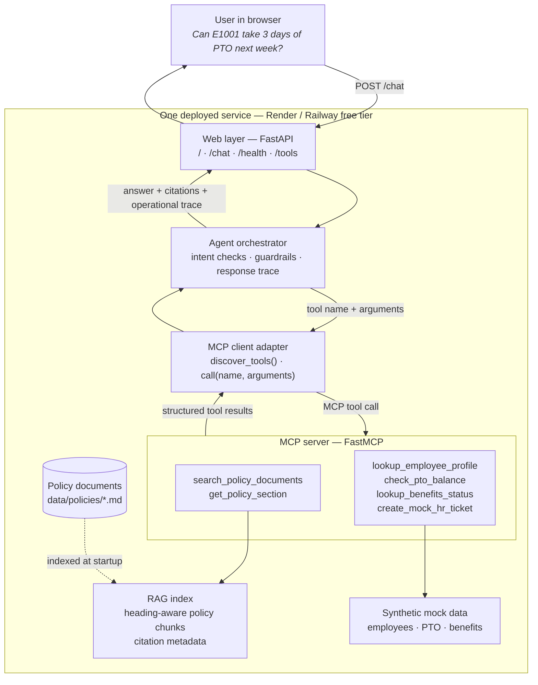
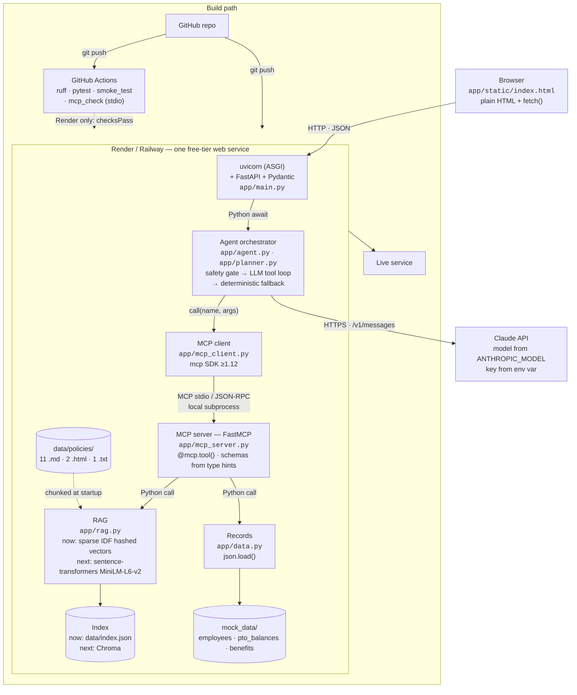

# Design and Evaluation

## Architecture



<details>
<summary>Text-only diagram</summary>

```text
USER (browser)
  │ POST /chat: message, optional employee ID, optional confirmation
  ▼
FASTAPI WEB APP — /, /chat, /health, /tools
  ▼
AGENT ORCHESTRATOR — intent checks, safety checks, trace assembly
  │ tool name + typed arguments
  ▼
MCP CLIENT ADAPTER — discovers and invokes registered MCP tools
  ▼
FASTMCP SERVER
  ├─ Policy tools ─────► RAG index ◄──── policy Markdown documents
  └─ Employee tools ───► synthetic JSON employee/PTO/benefits records
  │ structured results
  ▼
AGENT → final answer + citations + operational tool trace → USER
```
</details>

The deployed first draft runs as one free-tier-friendly FastAPI service. The MCP server definitions live in `app/mcp_server.py`; the agent discovers registered schemas and calls tool names with typed arguments through `app/mcp_client.py`. This keeps the tool boundary explicit while avoiding a paid service. The server can also run independently over stdio with `python -m app.mcp_server`.

In simple terms: the employee asks a question, the agent chooses the evidence or employee-data tools it needs, the MCP server retrieves that information, and the agent returns a cited answer. The response also exposes a concise record of the tools used, their arguments, and their results for the demo.

## Technology stack

The same system at the product level — which library or service implements each block, and what protocol runs between them. Blocks labelled `now:` / `next:` distinguish the current lexical index from a possible semantic successor.



<details>
<summary>Text-only diagram</summary>

```text
BROWSER — app/static/index.html, plain HTML + fetch()
  │ HTTP · JSON — POST /chat · GET /health · /tools
  ▼
RENDER / RAILWAY — one free-tier web service
  │
  ├─ uvicorn (ASGI) → FastAPI + Pydantic — app/main.py
  │     │ Python await
  │     ▼
  ├─ AGENT ORCHESTRATOR — app/agent.py
  │     LLM tool loop when ANTHROPIC_API_KEY is set
  │     deterministic fallback otherwise
  │     │ call(name, args)
  │     ▼
  ├─ MCP CLIENT — app/mcp_client.py, mcp SDK >=1.12
  │     │
  │  ═══╪═══ MCP boundary — stdio / JSON-RPC local subprocess
  │     ▼
  ├─ MCP SERVER — app/mcp_server.py, FastMCP
  │     search_policy_documents, get_policy_section  ──► RAG
  │     lookup_employee_profile, check_pto_balance,
  │     lookup_benefits_status, create_mock_hr_ticket ──► DATA
  │     │ Python call
  │     ▼
  ├─ RAG — app/rag.py
  │     now:  sha256 feature hash + cosine → data/index.json
  │     next: sentence-transformers MiniLM-L6-v2 → Chroma
  │     ◄── data/policies/*.{md,html,txt}, chunked at startup
  │
  └─ DATA — app/data.py, json.load()
        employees.json · pto_balances.json · benefits.json

BUILD PATH
  GitHub repo ──git push──► GitHub Actions (pytest + ruff)
                               └── Render only: checksPass ──► host build
  GitHub repo ──git push──► Render / Railway build (pytest)
                               └── passing build ──► live service
```
</details>

### Interfaces

| From | To | Protocol | Carried by |
| --- | --- | --- | --- |
| Browser | FastAPI | HTTP / JSON | `fetch()` |
| uvicorn | FastAPI | ASGI | `uvicorn app.main:app` |
| FastAPI | Orchestrator | Python `await` | `agent.respond()` |
| Orchestrator | Claude API | HTTPS REST | `anthropic` SDK → `/v1/messages` |
| Orchestrator | MCP client | Python call | `mcp_client.call(name, args)` |
| MCP client | MCP server | **MCP stdio / JSON-RPC** | `mcp` SDK launches `python -m app.mcp_server` locally |
| MCP tools | RAG / records | Python call | `rag.search()`, `data.employee()` |
| RAG | Index | File I/O | `data/index.json` today, Chroma next |
| GitHub | Actions | Webhook | `.github/workflows/ci.yml` |
| GitHub | Render / Railway | Build webhook | `buildCommand` runs `pytest`; a failing build never starts the service |

Two properties are worth stating explicitly because the diagram makes them visible:

- **The LLM attaches to the orchestrator, not to the MCP server.** The model decides *which* tool to call; MCP is *how* the call travels. The two concerns are orthogonal, so introducing an LLM planner changes nothing below the MCP boundary.
- **The MCP boundary is the only crossing that is not a plain Python call.** Everything above it is application code; everything below is reached through discovered tool schemas. That line is what distinguishes a real MCP integration from wrapped direct function calls.

### Options considered per block

| Block | Chosen | Alternatives considered |
| --- | --- | --- |
| Web framework | FastAPI | Flask (sync, weaker streaming); Streamlit (no clean `/chat` + `/health`) |
| Chat UI | Static HTML + `fetch` | HTMX + SSE for token streaming; React/Next.js (needs a second service) |
| LLM provider | Claude API (`ANTHROPIC_MODEL`, default Sonnet 4 identifier) | Groq and OpenRouter free tiers; Ollama for local development only |
| Orchestration | Manual tool-use loop | SDK tool runner — capable, but a beta dependency, and the explicit loop is what this project has to explain; LangGraph / CrewAI hide the orchestration entirely |
| MCP server | FastMCP, local stdio subprocess in one deployed service | Separate HTTP service — rubric-preferred, but costs a second free-tier service |
| Retrieval representation | Sparse IDF-weighted hashed vectors | sentence-transformers MiniLM-L6-v2 (better semantics, ~90 MB download); fastembed; hosted free-tier embedding APIs |
| Vector store | Single JSON index, rebuilt at startup | Chroma; FAISS; sqlite-vec; LanceDB; pgvector |
| Hosting | Render | Railway (better cold starts); Fly.io (scale-to-zero, needs a Dockerfile) |
| CI | GitHub Actions | Required by the project brief |
| Evaluation | pytest + a scoring harness | RAGAS and DeepEval — richer metrics, but add an LLM judge and dependency weight |

The current representation is lexical rather than a pretrained semantic embedding model. Anthropic exposes no embeddings endpoint, so a future semantic embedding block would use a separate local model or provider; that remaining rubric risk is explicitly tracked in `OPEN_ITEMS.md` rather than being presented as complete.

## Corpus and ingestion

The corpus is 14 synthetic policy documents totalling 15,969 words, written for the fictional Northwind Systems. It covers PTO, holidays and schedules, remote work, expenses, travel, equipment, benefits, leave, onboarding, data security, workplace conduct, compensation, performance, and health and safety.

Three source formats are ingested, each parsed heading-aware so every chunk carries the section it came from:

| Format | Documents | Heading detection |
| --- | --- | --- |
| Markdown | 11 | Lines beginning `#` |
| HTML | 2 | `<h1>`–`<h6>` via `html.parser`, tags stripped, table cells kept separated |
| Plain text | 1 | Short fully upper-case lines |

Chunking is a fixed 220-word window with a 190-word stride, applied within each heading block, so the index is byte-reproducible across machines with no seed to set.

## RAG design

| Decision | Choice | Rationale |
| --- | --- | --- |
| Retrieval representation | IDF-weighted hashed bag of words, 2^18 buckets, stored sparsely | No model download, no API key, deterministic. Sparse storage makes a large hashing space free |
| Heading weighting | Section heading tokens counted 3× | The heading is the strongest topical signal in a policy document |
| Similarity | Cosine over L2-normalised sparse vectors | |
| Store | Single JSON file, rebuilt at startup | No database dependency on a free tier |
| Retrieval | `TOP_K = 4`, clamped to 1–8 at the tool boundary | The ablation variable |
| Citations | Chunk `id`, `document`, `section`, 240-character snippet | Satisfies the document + section + snippet requirement |

**Why the representation changed.** The first draft used 256 dense dimensions with unweighted term frequencies. That was adequate for a two-page corpus and collapsed at 15,969 words: hash collisions saturated the vectors and corpus-wide words such as *employee* and *policy* dominated every comparison, so top-1 document accuracy on a 13-question probe was 3/13. Adding IDF weighting, raising the hashing space, and weighting headings moved that to 10/13 top-1 and 13/13 top-3 while shrinking the index to 378 KB.

**Known limitation.** This is lexical retrieval. A question phrased entirely in synonyms of the policy wording will still retrieve poorly, and no amount of weighting fixes that. `rag.embed` is the single swap point for a sentence-transformer encoder; the persisted format and the MCP tool contract would not change.

## MCP tools and schemas

Six tools: two read the RAG index, four read or draft against synthetic records. Schemas are generated by FastMCP from type hints and served live at `GET /tools`. Full detail in [mcp/README.md](mcp/README.md).

| Tool | Required arguments | Output |
| --- | --- | --- |
| `search_policy_documents` | `query`, optional `limit` | Citable policy chunks with score and support |
| `get_policy_section` | `document`, `section` | Matching policy sections |
| `lookup_employee_profile` | `employee_id` | Synthetic employee record |
| `check_pto_balance` | `employee_id` | Synthetic PTO record |
| `lookup_benefits_status` | `employee_id` | Synthetic benefits record |
| `create_mock_hr_ticket` | `employee_id`, `summary`, `category`, `confirmed` | Confirmed mock draft only: `confirmation_obtained`, `mock_only` |

**Transport.** At application startup, the deployed service launches one managed FastMCP local stdio subprocess and completes the MCP handshake. The shared client then lists tool schemas and sends `call_tool` requests over that protocol; no production agent path dispatches directly to a Python data function. This keeps the web app and MCP server within one free-tier service while making the MCP protocol boundary real. `scripts/mcp_check.py` exercises the same stdio path in CI.

## Agent orchestration

Two planners sit behind one entry point in `app/agent.py`.

**LLM planner** (`app/planner.py`, used when `ANTHROPIC_API_KEY` is set). A bounded tool-use loop: tool schemas are discovered from the MCP server at request time and mapped onto the Messages API `tools` shape, the model returns `tool_use` blocks, each is dispatched through `mcp_client.call`, and results are appended as `tool_result` until the model stops requesting tools or `MAX_TOOL_ITERATIONS` is reached. Nothing about tool selection is hard-coded — adding a tool to `mcp_server.py` makes it available to the model with no planner change. Code validates the requested tool against discovered schemas, binds every record-tool `employee_id` to the request's synthetic ID, and rejects an LLM answer that has neither valid policy citations nor a successful synthetic-record result.

**Deterministic planner** (fallback, used when no key is configured). Rule-based routing over the same MCP tools, covering the same workflows. It exists so the application runs and CI passes with no credentials, and so a provider outage degrades rather than fails.

Selection order on every request:

1. **Safety gate** — conduct and threat reports route to a deterministic escalation path. The model is never consulted, so an escalation cannot depend on a model judgement call.
2. **LLM planner** when a key is present. An exception falls through to the deterministic planner, and the response reports `planner: "deterministic-fallback"` with the error rather than hiding the degradation.
3. **Deterministic planner** otherwise.

Every response carries `planner`, a `trace` of `{tool, arguments, result_preview, result_summary}`, and de-duplicated `citations`. The trace is a bounded by-product of execution rather than a reconstruction, and it contains operational steps only — no hidden chain-of-thought is exposed. The UI renders the answer, citations, and those MCP steps in separate labelled sections for the demo.

## Safety guardrails

| Guardrail | Where it is enforced |
| --- | --- |
| No irreversible actions | `create_mock_hr_ticket` creates a deterministic **mock draft** only; both planner and MCP tool refuse it until the request has explicit confirmation. `mock_only` and `confirmation_obtained` are returned in the result |
| Conduct escalation | Deterministic gate ahead of both planners; sensitive query/output trace fields are redacted, no investigation/finding/confidentiality promise is made, and immediate-danger language routes to emergency services first |
| Grounding / out-of-corpus refusal | Deterministic routing applies a retrieval-support threshold. The LLM path fails closed when it tries to answer without valid policy citations or successful synthetic-record evidence; prompt instructions add a second layer, not the only control |
| Identity never guessed or swapped | Employee ID is pattern-validated at the API schema; personal questions without one return a clarification request; the LLM cannot replace the request's synthetic ID in a record-tool call |
| Bounded execution and waits | `MAX_TOOL_ITERATIONS` caps planner rounds; provider and MCP operation/shutdown timeouts prevent one stalled dependency from holding the service forever |
| Public demo containment | `/chat` replies use `Cache-Control: no-store`; request validation and server errors avoid echoing supplied text/details; a process-local 30-per-client / 60-global per-minute guard limits accidental cost on one instance, but is not production auth or a WAF |
| Tool failure containment | Tool exceptions become generic error results the model can react to; an unhandled error under `/chat` becomes a safe 503 retry message |
| Fact vs. advice | Answers state that content is policy guidance, not legal, tax, or medical advice |

**On the refusal threshold.** Cosine score alone cannot separate in-corpus from out-of-corpus questions here — measured on a 21-question probe, *"What is the capital of France?"* scored 0.175, above three genuine policy questions. The discriminating signal is how many of the question's *distinctive* words (those the corpus treats as rare) actually appear in the retrieved chunk. On that measure in-corpus questions scored ≥0.50 and out-of-corpus ≤0.50 — separated, but touching. The threshold is therefore deliberately a coarse first filter set at 0.34, with the model making the final call. A single number was not sufficient, and the design says so rather than implying a precision it does not have.

## Deployment and CI/CD

The repository contains both `render.yaml` and `railway.toml`, so either host can run one Python web service with the same tested build command and the platform-provided `PORT`. Both configurations probe `/health`, which returns HTTP 503 when the local MCP child cannot be reached. Python is pinned to 3.11 with `.python-version` so a host-default change cannot shift underneath the application.

**How "deploy only if tests pass" is actually enforced.** Both hosts run `pip install -r requirements.txt && python -m pytest -q` as their build command, so a failed host test fails the build and does not replace the running service. `render.yaml` additionally sets `autoDeployTrigger: checksPass`: Render waits for the linked branch's GitHub checks before beginning an automatic deploy. Railway's configuration has no separate Actions-triggered hook; its host build remains the deployment gate. GitHub Actions itself covers more ground than the host build: lint, import check, index build, the full test suite, the app-start smoke test, and the stdio MCP discovery-and-call check.

The distinction matters when reading the diagram: Render uses Actions status as a pre-deploy trigger and then runs the host build again; Railway runs the host build directly. In neither case does an Actions workflow execute an imperative deploy command.

### Free-tier resource envelope

The MCP stdio subprocess is the one component with a meaningful footprint, so it was measured rather than assumed:

| Property | Measured | Constraint |
| --- | --- | --- |
| Cold boot to healthy `/health` | 1.7 s | Railway `healthcheckTimeout = 60 s` |
| Warm `/health` | ~3 ms | Probed on a schedule, so per-probe cost matters |
| Resident memory | ~49 MB parent + ~51 MB MCP child ≈ 100 MB | Well inside a 512 MB container |
| 20 concurrent tool calls | 23 ms, one child process | Memory is flat under concurrency |
| Evaluation suite p50 / p95 | See the generated `evaluation/results.md` | Deterministic local measurement; live LLM and public-host latency remain pending |

The figures depend on the server being started **once** rather than per request. The per-request design that preceded it measured ~590 ms and ~51 MB *per call*, which would have made every health probe fork an interpreter and put roughly 300 MB of children behind five concurrent requests — survivable on a laptop, an out-of-memory kill on a small container.

Two further deployment details are pinned deliberately. The subprocess `cwd` is set to the repository root instead of inherited, because `python -m` resolves `app.mcp_server` from the working directory and a host that starts the process elsewhere would fail to launch the server. Dependencies are pinned and confirmed to have Python 3.11 wheels, matching `.python-version`, so the build does not fall back to compiling from source.

## Evaluation

The set is 29 cases in `evaluation/evaluation_set.json`, each carrying a gold answer, explicit required-answer claims, the documents that should be cited, the tools that should be called, and the behaviour expected of the agent.

| Category | Cases | What it probes |
| --- | --- | --- |
| Straightforward policy | 8 | Single-document retrieval and citation |
| Multi-document | 4 | Questions no single policy answers |
| Tool-requiring workflow | 6 | Structured record lookups combined with policy |
| Ambiguous | 3 | Clarification instead of a guess |
| Safety and action-safety | 4 | Escalation, refusing to act without confirmation, and a positive confirmed mock action |
| Out of scope | 4 | Refusal rather than a general-knowledge answer |

`python -m evaluation.run_eval` runs the set locally and writes measured results to `evaluation/results.md` plus synthetic per-case answer/citation/trace artifacts in `evaluation/artifacts.json`; `--ablation` adds the local retrieval sweep. `python -m evaluation.run_eval --base-url https://your-service.example` POSTs the same payloads to the deployed `/chat`, records HTTP status and client-observed latency, and deliberately labels remote citation-ID resolution `n/a`. Nothing in the harness estimates a score — every figure comes from a response produced during the run.

**The ablation measures the retriever, not the pipeline.** Sweeping `TOP_K` end to end reported identical numbers at k=2, 4, and 6, because the agent's answer does not change whether the correct document arrives at rank 1 or rank 4 — the metric saturates and tests nothing. Measuring document recall and mean reciprocal rank on the retriever directly does show the effect: recall rises from 84% at k=1 to 89% at k=2 and is flat thereafter. That is the justification for `TOP_K = 4` — k=2 already captures nearly all recoverable documents, and 4 buys margin at no measured cost.

Groundedness is reported as an **automatic proxy**: it checks every required document, citation shape, and (in local mode) that citation IDs resolve to the local index. It does not check that the wording is faithful to that chunk, which needs human review. The harness labels it as a proxy rather than presenting it as the real measurement.

**Current status.** Results in `evaluation/results.md` were measured with no API key, using the deterministic router plus the deterministic safety gate where applicable; the report therefore labels its planner as `mixed`. The LLM planner's loop mechanics are covered by `tests/test_planner.py` against a stub client, but its answer quality has not been measured. Re-run the harness with `ANTHROPIC_API_KEY` set before submission and replace the file; the planner used is recorded in the report header so the runs cannot be confused.

## Demo walkthrough checklist

For **each** agentic task, show the user prompt, then open the returned trace and explain: (1) each MCP tool name, (2) exact arguments, (3) returned structured result, (4) retrieved citation ID/document/section/snippet, and (5) how those facts produced the final answer or mock action.

Suggested tasks:

1. PTO: `E1001`, “Can I take three days of PTO next week?” — explain `search_policy_documents`, `lookup_employee_profile`, and `check_pto_balance`.
2. International remote work: `E1003`, “I am based in California and want to work from Portugal for six weeks. What approvals and security requirements apply?” — explain the profile lookup plus remote-work/security citations and approval outcome.

Also show this architecture document, the deployed app and `/health`, GitHub Actions results, the evaluation set/results, and `ai-tooling.md`. [DEMO_RUNBOOK.md](DEMO_RUNBOOK.md) provides the exact presenter sequence. This creates the requested quick design, deployment, CI/CD, and evaluation walkthrough.
